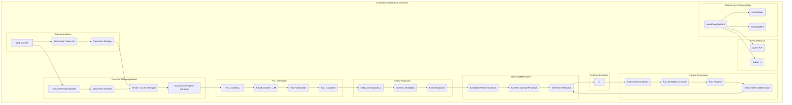

```mermaid
graph TD
    subgraph "3. System Architecture Overview"
        subgraph "Data Acquisition"
            A[Web Crawler] --> B(Document Processor)
            B --> C(Document Storage)
        end

        subgraph "Document Decomposition"
            D[Document Decomposer] --> E(Document Sections)
            E --> F(Section Cache Manager)
            F --> G(Taxonomic Property Extractor)
        end

        subgraph "Fact Extraction"
            H[Text Chunking] --> I(Fact Extraction LLM)
            I --> J(Fact Verification)
            J --> K(Fact Database)
        end

        subgraph "Entity Population"
          L(Entity Extraction LLM) --> M(Schema Validation)
          M --> N(Entity Database)
        end
        
        subgraph "Corpus Processing"
            O(Statistical Foundation)
            P(Fact Extraction at Scale) --> Q(Fact Analysis)
            Q --> R(Initial Schema Generation)
        end

        subgraph "Schema Refinement"
            S(Extraction Pattern Analysis) --> T(Schema Change Proposal)
            T --> U(Schema Verification)

        end
          
        subgraph "Schema Evolution"
            V --> O
            O --> P
        end
        

        subgraph "API & Interface"
          W(Query API)
          X(Admin UI)
        end
          
        subgraph "Monitoring & Observability"
          Y(Monitoring System) --> Z(Dashboards)
          Y --> AA(Alert System)
        end

        A --> D
        C --> F
        G --> H
        K --> L
        N --> S
        R --> U
        U --> V
        Y --> W
        Y --> X


    end
```
