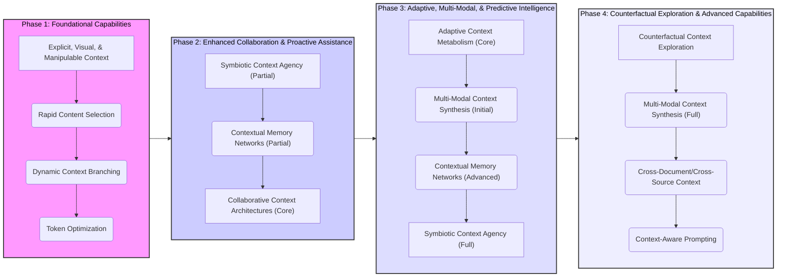
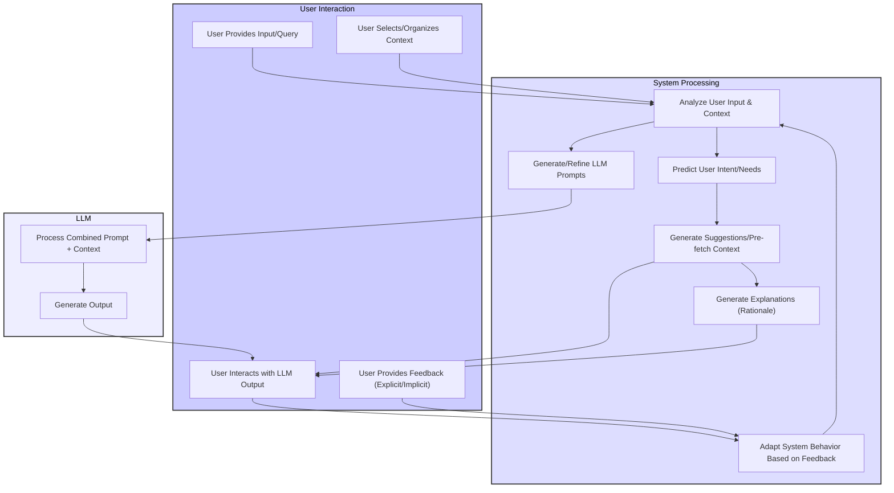
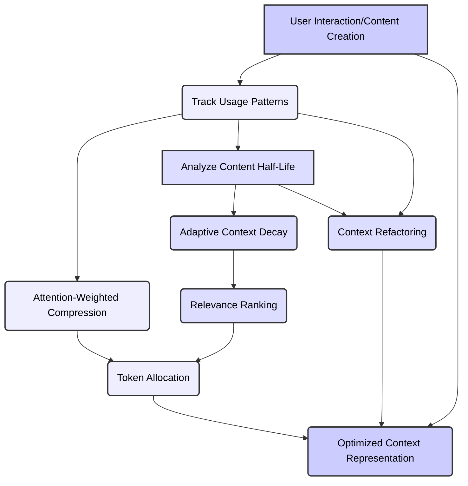
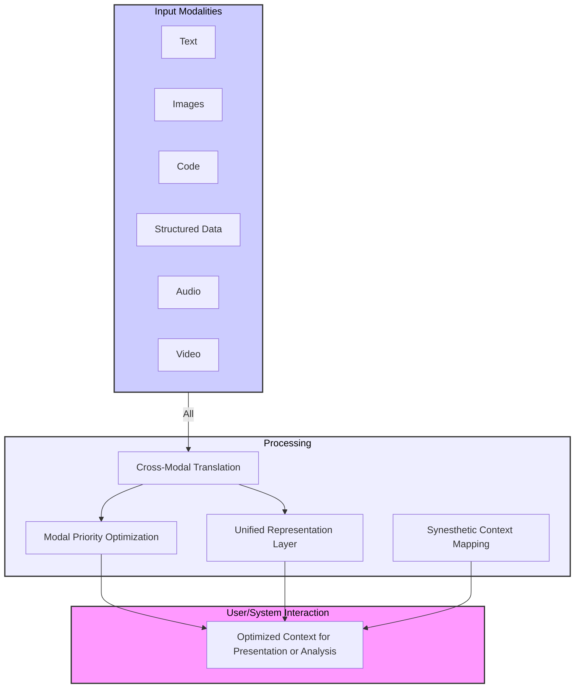
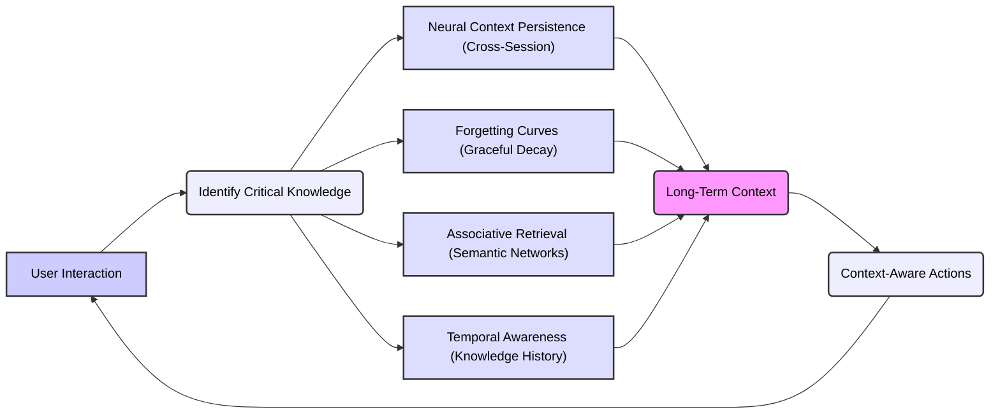
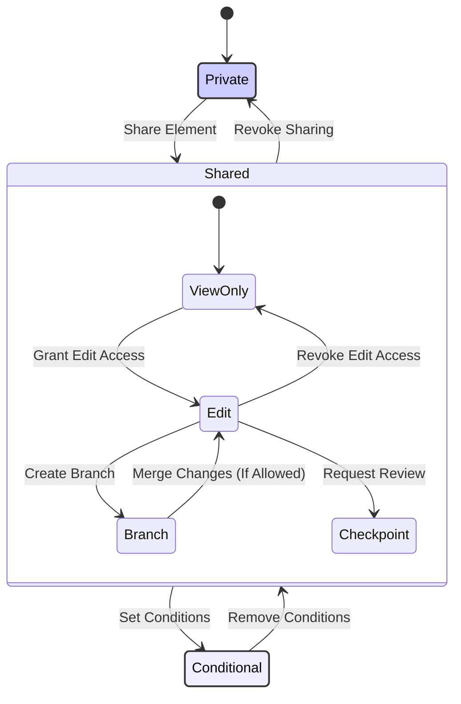
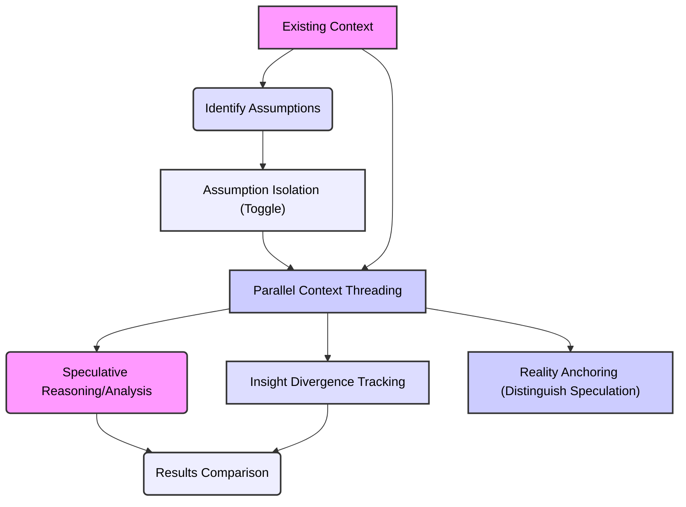

Okay, let's create Mermaid diagrams to visually represent the phased approach and key innovations outlined in the synthesized vision. I'll break this down into several diagrams for clarity:

**1. Overall Phased Roadmap (Flowchart)**

**2. Symbiotic Context Agency (Detailed Flowchart)**

**3. Adaptive Context Metabolism (Flowchart)**

**4. Multi-Modal Context Synthesis (Flowchart)**

**5. Contextual Memory Networks (Flowchart)**

**6. Collaborative Context Architectures (State Diagram)**

**7. Counterfactual Context Exploration (Flowchart)**

These Mermaid diagrams provide visual representations of the key innovations and their relationships. They should help in communicating the overall architecture and workflow of your enhanced context management system. Remember to paste each code block into a Mermaid renderer to see the diagrams.
